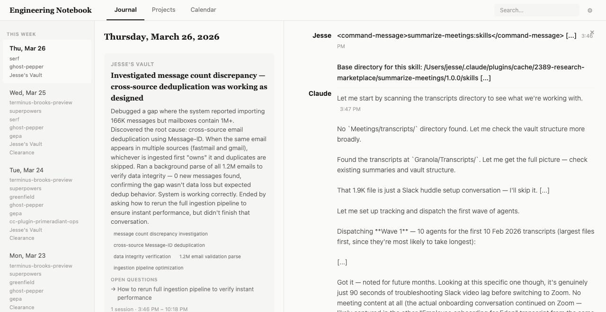
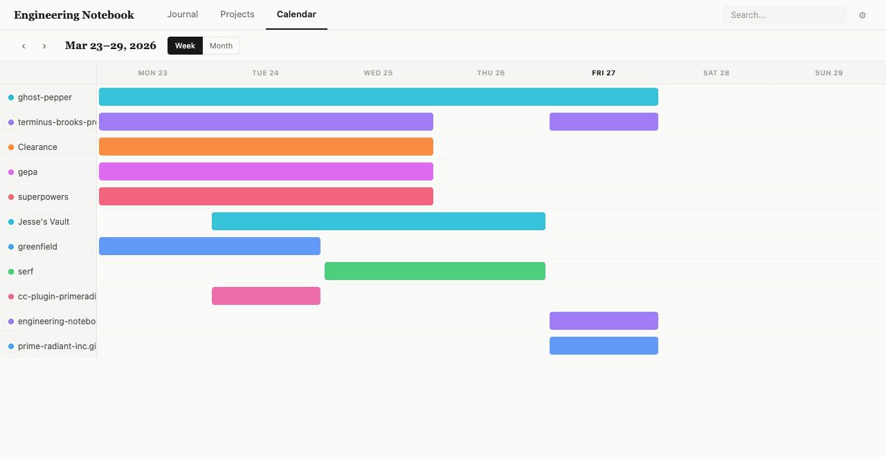
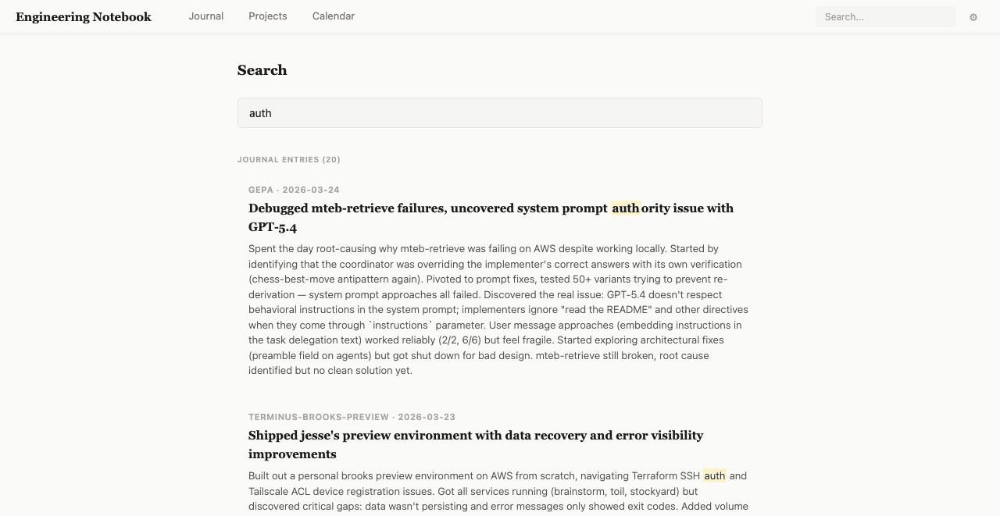

# Engineering Notebook

A CLI tool that ingests [Claude Code](https://docs.anthropic.com/en/docs/claude-code) and [Codex](https://openai.com/index/introducing-codex/) session transcripts, generates LLM-powered daily summaries, and serves a web UI for browsing your engineering journal.

Think of it as an automatic engineering diary — it watches your AI coding sessions and distills them into a searchable, browsable narrative of what you built, what problems you hit, and what decisions you made.



## How It Works

1. **Ingest** — Scans directories of Claude Code and Codex JSONL session files, parses out the human-readable conversation (stripping tool calls, thinking blocks, etc.), and stores them in SQLite.
2. **Summarize** — Groups sessions by date and project, then uses Claude to write concise engineering journal entries with headlines, summaries, topics, and open questions.
3. **Serve** — Runs a web server with a browsable UI: daily journal, project timelines, calendar/Gantt view, session transcripts, full-text search, and an iCal feed.

## Install

Requires [Bun](https://bun.sh) v1.1+.

```sh
git clone https://github.com/prime-radiant-inc/engineering-notebook.git
cd engineering-notebook
bun install
bun link  # makes `engineering-notebook` available globally
```

## Quick Start

```sh
# 1. Ingest your sessions (defaults to ~/.claude/projects and ~/.codex/sessions)
engineering-notebook ingest

# 2. Generate journal summaries (requires ANTHROPIC_API_KEY)
engineering-notebook summarize --all

# 3. Browse your journal
engineering-notebook serve
# Open http://localhost:3000
```

## Web UI

The web interface has several views:

- **Journal** — Three-panel layout: date index, entries for the selected date, and entry detail with full conversation transcripts. Entries include headlines, summaries, topic tags, and open questions.
- **Projects** — Browse all projects sorted by recency. Each project shows a timeline of journal entries with on-demand summarization for new sessions.
- **Calendar** — Week and month views with Gantt-style bars showing project activity across dates. Days link back to the journal view.
- **Search** — Full-text search across journal entries and conversation transcripts with highlighted results.
- **Settings** — Configure sources, exclusions, remote sources, summary instructions, auto-sync interval, and day start hour. Includes an iCal feed URL for subscribing in your calendar app.

|  |  |
|:---:|:---:|
| Calendar/Gantt view | Full-text search |

Each session transcript includes a resume command (`claude --resume <id>`) with a copy button for picking up where you left off.

## Usage

### `engineering-notebook ingest`

Scan source directories and ingest session files into the database.

```sh
engineering-notebook ingest                    # scan default sources
engineering-notebook ingest --source ~/extra   # add an extra source directory
engineering-notebook ingest --force            # re-ingest already-processed sessions
```

### `engineering-notebook summarize`

Generate LLM summaries for ingested sessions.

```sh
engineering-notebook summarize --all                      # summarize everything unsummarized
engineering-notebook summarize --date 2026-02-22          # summarize a specific date
engineering-notebook summarize --project myapp            # summarize a specific project
engineering-notebook summarize --date 2026-02-22 --project myapp  # both filters
```

### `engineering-notebook serve`

Start the web server.

```sh
engineering-notebook serve              # default port 3000
engineering-notebook serve --port 8080  # custom port
```

The server auto-syncs remote sources and re-ingests on a configurable interval (default: 60 seconds).

## Configuration

Config lives at `~/.config/engineering-notebook/config.json`:

```json
{
  "sources": ["~/.claude/projects", "~/.codex/sessions"],
  "exclude": ["-private-tmp*", "*-skill-test-*"],
  "db_path": "~/.config/engineering-notebook/notebook.db",
  "port": 3000,
  "day_start_hour": 5,
  "summary_instructions": "",
  "remote_sources": [],
  "auto_sync_interval": 60
}
```

| Field                  | Description                                                                              | Default                                        |
| ---------------------- | ---------------------------------------------------------------------------------------- | ---------------------------------------------- |
| `sources`              | Directories to scan for session files                                                    | `["~/.claude/projects", "~/.codex/sessions"]`  |
| `exclude`              | Glob patterns for directories to skip                                                    | `["-private-tmp*", "*-skill-test-*"]`          |
| `db_path`              | SQLite database location                                                                 | `~/.config/engineering-notebook/notebook.db`   |
| `port`                 | Web server port                                                                          | `3000`                                         |
| `day_start_hour`       | Hour (0-23) when a "day" starts (for grouping late-night sessions with the previous day) | `5`                                            |
| `summary_instructions` | Custom instructions appended to the LLM summarization prompt                             | `""`                                           |
| `remote_sources`       | SSH remote sources to sync before ingesting                                              | `[]`                                           |
| `auto_sync_interval`   | Seconds between auto-syncs when serving                                                  | `60`                                           |

### Remote Sources

Sync session files from remote machines over SSH:

```json
{
  "remote_sources": [
    {
      "name": "workstation",
      "host": "work.local",
      "path": "~/.claude/projects",
      "enabled": true
    }
  ]
}
```

### iCal Feed

When the server is running, subscribe to the iCal feed at:

```
webcal://localhost:3000/api/calendar.ics
```

This creates calendar events for each journal entry, viewable in Apple Calendar, Google Calendar, Outlook, etc.

## Development

```sh
bun install
bun test          # run tests
bun src/index.ts  # run from source
```

## Tech Stack

- [Bun](https://bun.sh) — runtime, bundler, test runner, SQLite
- [Hono](https://hono.dev) — web framework
- [Anthropic SDK](https://github.com/anthropics/anthropic-sdk-typescript) — LLM summarization (Claude Haiku)
- [HTMX](https://htmx.org) — interactive web UI without a JS framework

## License

Apache 2.0 — see [LICENSE](LICENSE).
